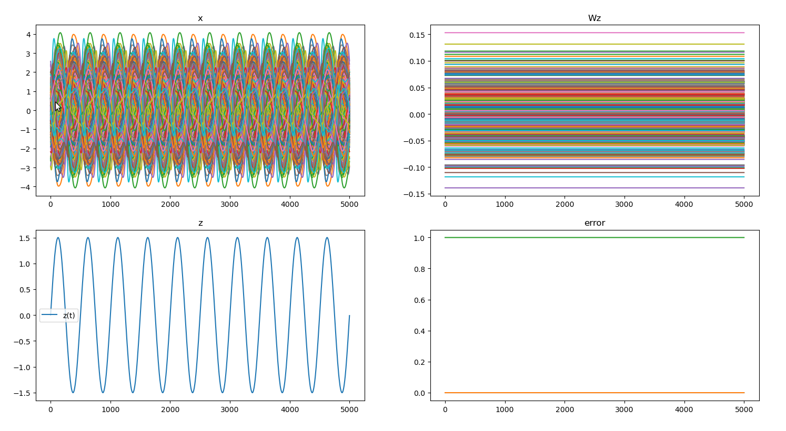

 
# ForceLearning
Impementation of the FORCE leanring algorithm

# Reference
Generating Coherent Patterns of Activity from Chaotic Neural Networks
David Sussillo and L. F. Abbott
Neuron 2009

https://www.ncbi.nlm.nih.gov/pmc/articles/PMC2756108/

# Author
Christoph Kirst, University of California San Francisco

# Example

Learning a sine wave:

 

Generation after traininig

 

